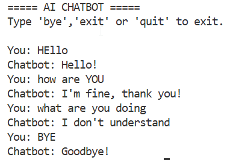
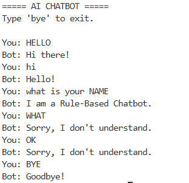

# 🤖 Simple Python Chatbots

A pair of lightweight, console-based chatbots demonstrating foundational approaches to conversational scripting in Python. This repository contains two versions: a rule-based conditional chatbot and a dictionary-based lookup chatbot.

---

## 📂 Project Structure

- **`chatbot_v1.py`**: A basic chatbot implemented using `if-else` conditionals.
- **`chatbot_v2.py`**: An improved chatbot utilizing a python dictionary for clean, modular response lookups.
- **`v1_output_ss.png` & `v2_output_ss.png`**: Screenshots showcasing the chatbots in action.

---

## ⚡ Features & Comparison

| Feature | Version 1 (Rule-Based) | Version 2 (Dictionary-Based) |
| :--- | :--- | :--- |
| **Logic** | Custom `if-elif-else` branches | Key-value mapping via Python Dictionary |
| **Maintainability** | Harder to scale as rules grow | Easy to add, modify, or delete responses |
| **Termination** | Responds to `bye`, `exit`, or `quit` | Responds to `bye` |
| **Default Handling** | Fallback catch-all condition | Key existence check fallback |

---

## 🚀 Getting Started

### Prerequisites
Make sure you have [Python 3](https://www.python.org/) installed on your system.

### Running the Chatbots
To run either version, open your terminal/command prompt and run:

**For Version 1:**
```bash
python chatbot_v1.py
```

**For Version 2:**
```bash
python chatbot_v2.py
```

---

## 📷 Screenshots

### Version 1 Output


### Version 2 Output

